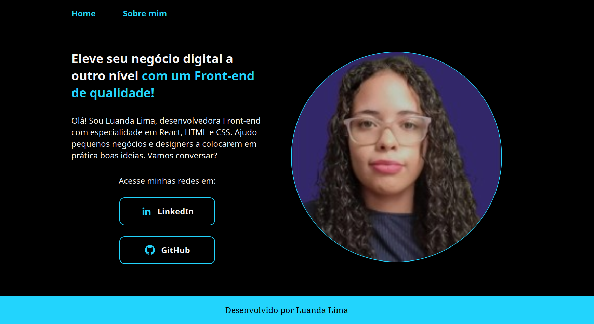

 # Portfólio
 

# Descrição do projeto
O objetivo desse projeto é aplicar conceitos aprendidos no durante os cursos  da Alura de 
HTML e CSS: trabalhando com responsividade e publicação de projetos
, utilizando da linguagem JavaScript, html e css

Ao acessar a pagina, temos o home com um breve resumo. 
Na aba sobre, é onde está descrito acerca de minhas certificções e objetivos.
Caso queira ver o projeto funcionando basta clicar no link: [Portifolio](https://portfolio-seven-gamma-10.vercel.app/about.html)

# Tecnologias utilizadas
- ``JavaSript``
-  ``HTML``
- ``CSS``
